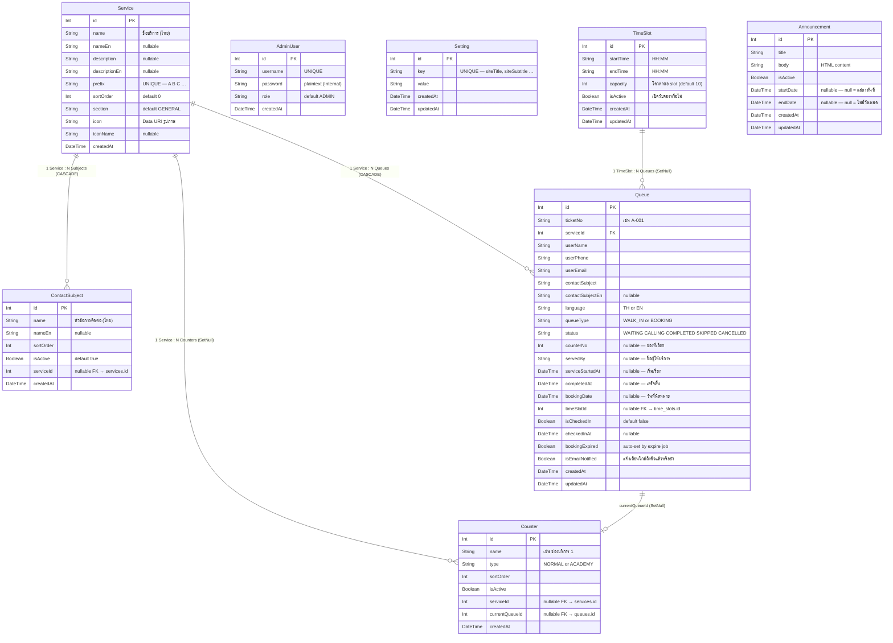

# 🏫 DENLA Queue System — ระบบคิวออนไลน์โรงเรียน

> ระบบจัดการคิวออนไลน์สำหรับสถานศึกษา **DENLA RAMA 5** รองรับทั้งคิว **Walk-in** และคิว **จองล่วงหน้า (Booking)** พร้อมอัปเดตสถานะแบบ Real-time ผ่าน Socket.IO และแจ้งเตือนทางอีเมล

---

## ✨ คุณสมบัติหลัก

| ฟีเจอร์ | รายละเอียด |
|---------|-----------|
| 🎫 คิว Walk-in | รับคิวหน้างานทันที ไม่ต้องจองล่วงหน้า |
| 📅 คิว Booking | จองช่วงเวลาล่วงหน้า กำหนด capacity ต่อ Time Slot |
| ✅ ระบบ Check-in | ผู้จองต้อง Check-in ภายใน 15 นาทีก่อน Slot เริ่ม |
| 📺 จอแสดงผล TV | แสดงคิวที่กำลังเรียก ณ แต่ละช่องบริการแบบ Real-time |
| 📱 ติดตามสถานะ QR | ผู้ใช้ติดตามสถานะคิวแบบ Real-time ผ่าน QR Code / Link |
| 🔔 แจ้งเตือนอีเมล | ยืนยันการจอง + แจ้งเตือนเมื่อใกล้ถึงคิว (เหลือ ≤ 2 คิว) |
| ⏱ Auto-expire Booking | คิว Booking เลย Slot ถูกยกเลิกอัตโนมัติทุก 30 วินาที |
| 🔄 ดึงคืนคิว | Admin ดึงคืนคิวที่ยกเลิก/ข้ามกลับมาใช้งานได้ |
| 🌐 รองรับ 2 ภาษา | ไทย / อังกฤษ (เลือกตอนจองคิว) |
| 📢 ระบบประกาศ | Ticker ประกาศบนจอ TV + Popup บนหน้าจองคิว |
| 📊 รายงานสถิติ | Dashboard สรุปสถิติวันนี้ + Report รายวันพร้อม Time Metrics |

---

## 🛠 Tech Stack

| ส่วน | เทคโนโลยี | Version |
|------|----------|----|
| **Backend** | Node.js + Express + TypeScript | Express ^4.21 |
| **Database** | SQLite via Prisma ORM | Prisma ^5.20 |
| **Real-time** | Socket.IO | ^4.8.0 |
| **Email** | Nodemailer (SMTP) | ^6.9 |
| **Frontend** | React 18 + Vite + Tailwind CSS | React ^18.3 |
| **Routing** | React Router DOM v6 | ^6.26 |
| **HTTP Client** | Axios | ^1.7 |
| **Deployment** | Docker + Nginx | — |

---

## 📁 โครงสร้างโปรเจค

```
denla-queue/
├── backend/
│   ├── src/
│   │   ├── server.ts          # Express + Socket.IO (entry point — API ทั้งหมด)
│   │   └── db.ts              # Prisma client singleton
│   ├── prisma/
│   │   ├── schema.prisma      # Database schema (8 models)
│   │   ├── seed.ts            # Seed ข้อมูลเริ่มต้น
│   │   ├── seed_presentation.ts  # Seed สำหรับ Demo นำเสนอ
│   │   ├── migrations/        # Migration history (SQLite)
│   │   └── data/              # SQLite .db file (persistent volume)
│   ├── .env / .env.example
│   └── Dockerfile
├── frontend/
│   ├── src/
│   │   ├── App.jsx            # Routes + Auth Guard
│   │   ├── api.js             # Axios API wrapper functions
│   │   ├── socket.js          # Socket.IO singleton
│   │   ├── pages/
│   │   │   ├── BookingPage.jsx       # หน้าจองคิว (Multi-step)
│   │   │   ├── TicketPage.jsx        # หน้าติดตามคิว Real-time
│   │   │   ├── DisplayPage.jsx       # จอ TV แสดงคิว
│   │   │   ├── AdminPage.jsx         # Operator — เรียกคิว
│   │   │   ├── AdminManagementPage.jsx  # Management — ตั้งค่าระบบ
│   │   │   └── AdminLoginPage.jsx    # หน้า Login
│   │   └── components/
│   └── Dockerfile
├── nginx/default.conf         # Reverse proxy config
├── docker-compose.yml
├── docs/ER_DIAGRAM.md         # ER Diagram ฉบับสมบูรณ์
└── README.md
```

---

## 🗃 ER Diagram (โครงสร้างฐานข้อมูล)



---

## 🔄 Queue Status Flow — ขั้นตอนการทำงานของคิว

```
                  ┌──────────────────────────────────────────────┐
  จองคิว/Walk-in  │                                              │
       │          │                                              │
       ▼          ▼                                              │
   [WAITING] ─── (Admin ข้าม) ───► [SKIPPED] ── (Admin ดึงคืน) ─┘
       │                               │
  (Admin เรียก)                   (Admin ยกเลิก)
       │                               │
       ▼                               ▼
   [CALLING]                      [CANCELLED] ◄── Auto-expire (30s)
       │                                           (Booking เลย Slot)
  (Admin เสร็จ)
       │
       ▼
  [COMPLETED]
```

### รายละเอียด Transition

| จาก | ไป | ผู้กระทำ | เงื่อนไข |
|-----|----|--------|---------|
| WAITING | CALLING | Admin (Next/Call) | ช่องว่าง, คิวพร้อม |
| CALLING | COMPLETED | Admin (Complete) | — |
| CALLING | SKIPPED | Admin (Skip) | — |
| CALLING | CALLING | Admin (Recall) | เรียกซ้ำอีกครั้ง |
| SKIPPED | WAITING | Admin (Reinsert) | ดึงคืนคิวข้าม |
| SKIPPED | CANCELLED | Admin (Cancel) | — |
| WAITING | CANCELLED | Auto-expire Job | Booking เลยเวลา Slot |
| CANCELLED | WAITING | Admin (Reinsert) | ดึงคืนคิวหมดอายุ |

---

## 🧠 Logic การเรียงลำดับคิว (Priority Rules)

เมื่อ Admin กด **"เรียกคิวถัดไป"** ระบบเลือกคิวตาม Priority ดังนี้:

```
Priority 1 (สูงสุด): BOOKING ที่ isCheckedIn=true AND slotStart ≤ now
                     → เรียงด้วย [slotStartTime ASC, checkedInAt ASC]

Priority 2:          WALK_IN WAITING
                     → เรียงด้วย [id ASC] (มาก่อนได้ก่อน)

Priority 3:          BOOKING ที่ isCheckedIn=true แต่ slot ยังไม่เริ่ม
                     → เรียงด้วย [slotStartTime ASC, checkedInAt ASC]

Priority 4 (ต่ำสุด): คิวอื่นๆ → เรียงด้วย id ASC
```

> **ตัวอย่าง:** ถ้า slot 09:00 เริ่มแล้ว และมี Walk-in รออยู่ก่อน  
> ระบบจะเรียก Booking slot 09:00 ก่อน แล้วจึงเรียก Walk-in

---

## ⏱ Auto-Expire Booking Job

ทุก **30 วินาที** ระบบตรวจ Booking ที่ค้างอยู่และจัดการอัตโนมัติ:

```
Booking ที่ bookingDate < วันนี้ (เลยวันแล้ว)
   → ยกเลิก (CANCELLED) + bookingExpired = true

Booking ที่ isCheckedIn=false AND slotStartTime+5min < now (มาสาย)
   → เปลี่ยนเป็น SKIPPED + bookingExpired = true
   → Admin ยังสามารถ Reinsert ได้
```

### Booking Restore Logic (Admin ดึงคืนคิวหมดอายุ)

```
1. Admin กด "ดึงคืน" บนคิว bookingExpired=true / SKIPPED
2. Backend ตรวจ: slotEnd < now OR bookingExpired=true
3. ถ้าใช่ → set isCheckedIn=true (ป้องกัน re-expire)
4. คิวกลับเป็น WAITING (bookingExpired=false)
5. expireOverdueBookings() ข้ามคิวที่ isCheckedIn=true → ไม่ expire ซ้ำ
```

---

## 📬 ระบบแจ้งเตือนอีเมล

| เหตุการณ์ | เวลาส่ง | เนื้อหา |
|----------|---------|--------|
| จองคิวสำเร็จ | ทันที | เลขคิว + QR Code + Link ติดตาม |
| ใกล้ถึงคิว | เมื่อ waiting ≤ 2 คิว | แจ้งให้เตรียมตัว (ส่งครั้งเดียว) |

> Email เป็น **best-effort** — หาก SMTP ไม่ได้ตั้งค่า ระบบทำงานปกติ errors ถูก swallow

---

## 🔌 Socket.IO Events

### Client → Server (Subscribe)

| Event | Payload | ผลลัพธ์ |
|-------|---------|--------|
| `subscribe:service` | serviceId | เข้าห้อง `service:{id}` (Admin board) |
| `subscribe:track` | queueId | เข้าห้อง `queue:{id}` (Ticket tracking) |

### Server → Client (Broadcast)

| Event | ส่งไปที่ | Payload | เมื่อ |
|-------|---------|---------|------|
| `queue:new` | broadcast | Queue object | สร้างคิวใหม่สำเร็จ |
| `queue:called` | broadcast | Queue + eventId | Admin เรียกคิว |
| `queue:skipped` | broadcast | Queue | Admin ข้ามคิว |
| `queue:reinserted` | broadcast | Queue | Admin ดึงคืนคิว |
| `queue:updated` | room `queue:{id}` | Queue | Expire / Reinsert |
| `queue:almost-your-turn` | room `queue:{id}` | Queue | ใกล้ถึงคิว ≤ 2 |
| `queue:board` | room `service:{id}` | Queue[] | หลัง Admin action |
| `dashboard:update` | broadcast | — | สถานะเปลี่ยน |
| `display:update` | broadcast | — | สถานะเปลี่ยน |
| `settings:updated` | broadcast | {key, value} | บันทึกการตั้งค่า |

> `eventId` บน `queue:called` ใช้ Dedup ที่ DisplayPage เพื่อกัน TTS เล่นซ้ำ

---

## 🌐 API Reference

### Public Endpoints

| Method | Path | คำอธิบาย |
|--------|------|---------|
| GET | `/api/services` | รายการประเภทบริการทั้งหมด |
| GET | `/api/contact-subjects?serviceId=` | หัวข้อการติดต่อตามบริการ |
| GET | `/api/time-slots/available?date=` | Time Slot ที่ว่างในวันที่ระบุ |
| POST | `/api/queues` | สร้างคิวใหม่ (Walk-in / Booking) |
| GET | `/api/queues/:id` | ข้อมูลคิว + waitingAhead |
| POST | `/api/queues/:id/check-in` | Check-in สำหรับ Booking |
| GET | `/api/display` | ข้อมูลสำหรับจอ TV |
| GET | `/api/announcements/active?date=` | ประกาศที่ Active วันนั้น |
| GET | `/health` | Health check |

### Admin — Queue Operations

| Method | Path | คำอธิบาย | HTTP Errors |
|--------|------|---------|------------|
| GET | `/api/admin/queues?serviceId=` | คิววันนี้ (เรียงตาม Priority) | — |
| GET | `/api/admin/queues/skipped` | รายการคิว SKIPPED | — |
| GET | `/api/admin/bookings?date=&serviceId=` | รายการ Booking | 400 |
| GET | `/api/admin/dashboard` | สถิติวันนี้แยกบริการ | — |
| GET | `/api/admin/reports?date=&serviceId=` | รายงานรายวัน + Time Metrics | — |
| PATCH | `/api/admin/queues/next` | เรียกคิวถัดไป (Priority-based) | 400, 404, 409 |
| PATCH | `/api/admin/queues/:id/call` | เรียกคิวเจาะจง | 400, 404, 409 |
| PATCH | `/api/admin/queues/:id/recall` | เรียกซ้ำ (Recall) | — |
| PATCH | `/api/admin/queues/:id/complete` | เสร็จสิ้นการให้บริการ | — |
| PATCH | `/api/admin/queues/:id/skip` | ข้ามคิว | — |
| PATCH | `/api/admin/queues/:id/reinsert` | ดึงคืนคิว (SKIPPED/CANCELLED) | 400 |
| PATCH | `/api/admin/queues/:id/cancel` | ยกเลิกคิว | — |

### Admin — Management CRUD

| Resource | GET | POST | PATCH/PUT /:id | DELETE /:id | Reorder |
|----------|-----|------|----------------|-------------|---------|
| `/api/admin/settings` | ✅ | ✅ (upsert) | — | — | — |
| `/api/admin/users` | ✅ | ✅ | ✅ | ✅ | — |
| `/api/services` | ✅ | ✅ | ✅ | ✅ | ✅ |
| `/api/admin/contact-subjects` | ✅ | ✅ | ✅ | ✅ | ✅ |
| `/api/admin/counters` | ✅ | ✅ | ✅ | ✅ | ✅ |
| `/api/admin/time-slots` | ✅ | ✅ | PUT ✅ | ✅ | — |
| `/api/admin/announcements` | ✅ | ✅ | PUT ✅ | ✅ | — |
| `/api/admin/login` | — | ✅ | — | — | — |

---

## 🖥 หน้าต่างๆ (Pages)

### `/` — BookingPage
Multi-step wizard: **เลือกบริการ → Walk-in/Booking → กรอกข้อมูล → ยืนยัน**
- Booking: เลือกวันที่ + Time Slot → ส่งอีเมลยืนยัน + QR tracking
- แสดงประกาศ Popup ทุกครั้งที่เข้าหน้า
- รองรับ 2 ภาษา (ไทย/อังกฤษ)

### `/track/:id` — TicketPage
Real-time queue tracking สำหรับผู้ใช้:
- รับ events: `queue:board`, `queue:updated`, `queue:called`, `queue:reinserted`, `queue:skipped`
- แสดง **waitingAhead** (จำนวนคิวที่รออยู่ข้างหน้า)
- Booking: ปุ่ม Check-in (เปิดใช้ 15 นาทีก่อน Slot เริ่ม)
- แสดง QR Code ของ URL สำหรับแชร์

### `/display` — DisplayPage
จอ TV สำหรับแสดงในพื้นที่บริการ:
- Grid แสดงแต่ละช่องบริการ + เลขคิวที่กำลังเรียก
- Animation + **TTS เสียงประกาศ** เมื่อมีคิวใหม่
- Dedup ด้วย `eventId` (กัน TTS เล่นซ้ำ)
- Ticker ประกาศวิ่งด้านล่าง

### `/admin` — AdminPage (Operator)
หน้าควบคุมสำหรับเจ้าหน้าที่:
- เรียกคิวถัดไป / เรียกซ้ำ / เสร็จสิ้น / ข้ามคิว / ยกเลิก
- ดูคิวรอแยกตามบริการ พร้อม Priority Sort
- เรียกคิวเฉพาะ (ต้องยืนยัน — Bypass ลำดับ)
- Modal ดึงคืนคิวยกเลิก (Badge แสดง "Booking หมดอายุ")
- แท็บ Booking: รายการจอง, Check-in แทนผู้ใช้

### `/admin/management` — AdminManagementPage
หน้าตั้งค่าระบบสำหรับผู้ดูแล:
- **Web tab**: ชื่อระบบ, โลโก้, CRUD Admin Users
- **Booking tab**: ประเภทบริการ, Contact Subjects, Time Slots, ประกาศ
- **Display tab**: เสียง TTS, CRUD ช่องบริการ (Counters)

---

## ⚙ Background Jobs

| งาน | ความถี่ | หน้าที่ |
|-----|---------|--------|
| `expireOverdueBookings()` | ทุก **30 วินาที** | ยกเลิก/Skip Booking ที่เลยเวลา Slot |
| `initializeDatabaseDefaults()` | **1 ครั้ง** ตอน Start | Seed admin, settings, backfill bookingDate |
| `backfillMissingQueueDates()` | ตอน Start | เติม bookingDate สำหรับคิวเก่าที่ไม่มี |

---

## 📊 Reports & Dashboard

### Dashboard (`/api/admin/dashboard`)
สถิติวันนี้แยกตามแต่ละบริการ:

| Field | คำอธิบาย |
|-------|---------|
| `waiting` | จำนวนคิวที่รออยู่ (พร้อมให้บริการ) |
| `calling` | จำนวนคิวที่กำลังเรียก |
| `skipped` | จำนวนคิวที่ถูกข้าม |
| `total` | คิวทั้งหมดวันนี้ |
| `walkIn` | แยกจำนวน Walk-in |
| `booking` | แยกจำนวน Booking |

### Reports (`/api/admin/reports?date=&serviceId=`)
รายงานรายวันพร้อม **Time Metrics**:

| Field | คำอธิบาย |
|-------|---------|
| `waitingSeconds` | เวลารอ (สร้างคิว/check-in → serviceStartedAt) |
| `serviceSeconds` | เวลาให้บริการ (serviceStartedAt → completedAt) |
| `totalSeconds` | รวมทั้งหมด |

---

## 🐳 การติดตั้ง (Docker — แนะนำ)

```bash
git clone <repo-url>
cd denla-queue

# คัดลอกและแก้ไข environment
cp backend/.env.example backend/.env
# แก้ไขค่าที่จำเป็นใน backend/.env

# Build และ Start
docker-compose up -d --build
```

เข้าถึงระบบที่: **http://localhost:8080**

| Service | Port (host) | หน้าที่ |
|---------|-------------|--------|
| nginx | 8080 | Reverse proxy → Frontend + Backend |
| backend | internal:3000 | API + Socket.IO |
| frontend | internal:80 | React SPA |

**Volume:** `queue_data → /app/data` (SQLite persistence)

---

## 🔧 Local Development

```bash
# Backend
cd backend
npm install
npx prisma db push
npm run dev          # tsx watch (hot reload)

# Frontend (terminal ใหม่)
cd frontend
npm install
npm run dev
```

สร้างไฟล์ `frontend/.env.local`:
```
VITE_API_BASE_URL=http://localhost:3000
VITE_SOCKET_URL=http://localhost:3000
```

---

## 📝 Environment Variables

| Variable | Required | Default | คำอธิบาย |
|----------|----------|---------|---------|
| `DATABASE_URL` | ✅ | — | `file:./prisma/data/school_queue.db` |
| `PORT` | ❌ | 4000 | Backend port |
| `FRONTEND_BASE_URL` | ❌ | จาก request | URL สำหรับ email links |
| `SMTP_HOST` | ❌ | — | SMTP server hostname |
| `SMTP_PORT` | ❌ | 587 | 587=STARTTLS, 465=SSL |
| `SMTP_SECURE` | ❌ | false | `true` สำหรับ SSL |
| `SMTP_USER` | ❌ | — | SMTP username |
| `SMTP_PASS` | ❌ | — | SMTP password |
| `SMTP_FROM` | ❌ | — | From email address |
| `ADMIN_USERNAME` | ❌ | admin | Admin username เริ่มต้น |
| `ADMIN_PASSWORD` | ❌ | denla2026 | Admin password เริ่มต้น |
| `VITE_API_BASE_URL` | ❌ | /api | Frontend API URL |
| `VITE_SOCKET_URL` | ❌ | window.origin | Socket.IO URL |

---

## 🔗 URL Summary

| URL | หน้า | Auth |
|-----|------|------|
| `/` | จองคิว | Public |
| `/track/:id` | ติดตามคิว | Public |
| `/display` | จอ TV | Public |
| `/admin/login` | Login | Public |
| `/admin` | Operator | sessionStorage token |
| `/admin/management` | Management | sessionStorage token |

---

## 🚀 Scripts

### Backend (`cd backend`)
| Script | คำอธิบาย |
|--------|---------|
| `npm run dev` | Hot-reload dev server (tsx watch) |
| `npm run build` | Compile TypeScript → dist/ |
| `npm run start` | Production (node dist/server.js) |
| `npm run prisma:seed` | Seed ข้อมูลเริ่มต้น |
| `npm run prisma:migrate` | Apply migrations (production) |
| `npm run prisma:migrate:dev` | สร้าง migration ใหม่ (dev) |

### Frontend (`cd frontend`)
| Script | คำอธิบาย |
|--------|---------|
| `npm run dev` | Vite dev server |
| `npm run build` | Production build → dist/ |
| `npm run preview` | Preview production build |

---

## ⚠ ข้อควรทราบ

> [!IMPORTANT]
> **Security:** ออกแบบสำหรับใช้งานภายใน **Intranet/LAN** ไม่มี server-side auth middleware บน Admin API ไม่ควรเปิดให้ Internet เข้าถึงโดยตรง

> [!NOTE]
> **Database:** SQLite เหมาะสำหรับโรงเรียนขนาดเล็ก-กลาง หากต้องการ scale ให้เปลี่ยน datasource เป็น PostgreSQL ใน `schema.prisma`

> [!NOTE]
> **Email:** หากไม่ตั้ง SMTP ระบบทำงานได้ปกติ — email errors ถูก swallow ไม่กระทบการจองคิว

> [!WARNING]
> **Passwords:** Admin password เก็บเป็น plaintext — เหมาะสำหรับ internal school tool เท่านั้น

---

## 🗂 Migration History

| # | Migration ID | วันที่ | การเปลี่ยนแปลง |
|---|---|---|---|
| 1 | `20260902044421_queue_booking_v2` | 2026-09-02 | สร้าง schema ทั้งหมด — 8 ตาราง |
| 2 | `20260908090000_booking_expiry_override` | 2026-09-08 | เพิ่ม `booking_expired` column ใน queues |
| 3 | `20260914_add_cascade_delete_service_queue` | 2026-09-14 | queues.service_id FK: RESTRICT → CASCADE |
