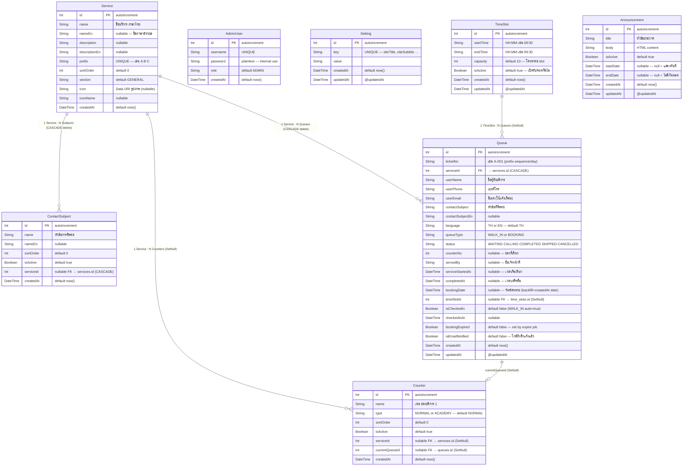

# ER Diagram — DENLA Queue System

> อัพเดท: 2026-09-22 | Database: SQLite (Prisma ORM) | Version: v1.3

---

## Entity Relationship Diagram



---

## Tables (SQL Mapping)

| Prisma Model | SQL Table | คำอธิบาย |
|---|---|---|
| Service | `services` | ประเภทบริการ เช่น จ่ายค่าเทอม, สมัครเรียน |
| AdminUser | `admin_users` | ผู้ดูแลระบบ (Operator / Admin) |
| Setting | `settings` | การตั้งค่าระบบแบบ key-value |
| ContactSubject | `contact_subjects` | หัวข้อการติดต่อแยกตามบริการ |
| Queue | `queues` | รายการคิวทั้งหมด (Walk-in + Booking) |
| TimeSlot | `time_slots` | ช่วงเวลาให้บริการสำหรับ Booking |
| Announcement | `announcements` | ประกาศ/แจ้งเตือน |
| Counter | `counters` | ช่องบริการ (เคาน์เตอร์) |

---

## Indexes

| Table | Index | Type |
|---|---|---|
| `services` | `prefix` | UNIQUE |
| `admin_users` | `username` | UNIQUE |
| `settings` | `key` | UNIQUE |
| `contact_subjects` | `(service_id, name)` | UNIQUE composite |
| `queues` | `(service_id, status, booking_date)` | INDEX |

---

## Foreign Keys & Delete Behavior

| จาก Table | Column | → ไป Table | On Delete |
|---|---|---|---|
| `queues` | `service_id` | `services.id` | **CASCADE** |
| `queues` | `time_slot_id` | `time_slots.id` | **SET NULL** |
| `contact_subjects` | `service_id` | `services.id` | **CASCADE** |
| `counters` | `service_id` | `services.id` | **SET NULL** |
| `counters` | `current_queue_id` | `queues.id` | **SET NULL** |

---

## Queue Status Lifecycle

```
                  ┌─────────────────────────────────────────────────┐
  สร้างคิวใหม่    │   Admin ดึงคืน (Reinsert)                       │
  (WALK_IN/BOOKING)│                                                 │
        │         ▼                                                 │
        └──► [WAITING] ──── Admin ข้าม ────► [SKIPPED] ────────────┘
                  │                              │
             Admin เรียก                    Admin ยกเลิก
                  │                              │
                  ▼                              ▼
             [CALLING]                      [CANCELLED] ◄── Auto-expire
                  │                                          (30s job)
          ┌───────┼───────────┐
     เสร็จสิ้น  เรียกซ้ำ    ข้ามคิว
          │       │           │
          ▼       │           ▼
     [COMPLETED]  └──► [CALLING]   [SKIPPED]
```

### Queue Status Transitions

| จาก | ไป | เงื่อนไข |
|---|---|---|
| WAITING | CALLING | Admin กด Next/Call, ช่องว่าง |
| CALLING | COMPLETED | Admin กด Complete |
| CALLING | SKIPPED | Admin กด Skip |
| CALLING | CALLING | Admin กด Recall (เรียกซ้ำ) |
| WAITING | CANCELLED | Auto-expire: Booking เลย Slot |
| SKIPPED | WAITING | Admin กด Reinsert |
| CANCELLED | WAITING | Admin กด Reinsert (Booking expired) |

---

## Priority Sort Logic (Queue Ordering)

เมื่อ Admin กด "เรียกคิวถัดไป" ระบบเลือกคิวตาม Priority Rule:

```
Bucket 0 (สูงสุด): BOOKING + isCheckedIn=true + slotStart ≤ now
                   เรียงด้วย: slotStartTime ASC → checkedInAt ASC

Bucket 1:          WALK_IN + status=WAITING
                   เรียงด้วย: id ASC (FIFO)

Bucket 2:          BOOKING + isCheckedIn=true + slotStart > now
                   เรียงด้วย: slotStartTime ASC → checkedInAt ASC

Bucket 3 (ต่ำสุด): อื่นๆ
                   เรียงด้วย: id ASC
```

---

## Special Fields Design Notes

### `Queue.bookingDate`
- **BOOKING:** วันที่นัดหมาย (parseDateOnly, time=00:00:00)
- **WALK_IN:** backfill ด้วย `createdAt` date (setHours 0,0,0,0)
- ใช้สำหรับ filter "คิวของวันนี้" แทน createdAt

### `Queue.isCheckedIn`
- WALK_IN: ตั้งเป็น `true` ตั้งแต่แรก (auto-check-in)
- BOOKING: ต้อง Check-in ภายใน 15 นาทีก่อน slotStart
- เมื่อ Admin Reinsert คิว Booking หมดอายุ → set `true` เพื่อป้องกัน re-expire

### `Queue.bookingExpired`
- ตั้งโดย `expireOverdueBookings()` job ทุก 30 วินาที
- `true` = คิว Booking ถูก expire อัตโนมัติ
- Admin ยังสามารถ Reinsert ได้ (จะ set `false` กลับ)

### `Counter.currentQueueId`
- ชี้ไปยัง Queue ที่กำลัง CALLING ณ Counter นั้น
- ใช้ใน `/api/display` สำหรับแสดงบนจอ TV
- เมื่อคิว COMPLETE/SKIP/CANCEL → ถูก clear เป็น NULL (SET NULL)

### `Queue.isEmailNotified`
- ป้องกันการส่งอีเมล "ใกล้ถึงคิว" ซ้ำกัน
- ตั้ง `true` หลังส่งอีเมลสำเร็จ 1 ครั้งเท่านั้น

---

## Booking Auto-Expire Rules

```
ทุก 30 วินาที — expireOverdueBookings() ทำงาน:

1. ดึง Booking ทั้งหมดที่ status NOT IN (COMPLETED, CANCELLED)
   และ bookingDate NOT NULL

2. สำหรับแต่ละ Booking:
   a. bookingDate < วันนี้
      → status = CANCELLED, bookingExpired = true

   b. bookingDate = วันนี้ AND isCheckedIn = false
      AND status = WAITING AND slotStartTime + 5min < now
      → status = SKIPPED, bookingExpired = true

3. ส่ง Socket.IO event: queue:updated ไปยัง queue room
4. ส่ง dashboard:update broadcast
```

---

## Migration History

| # | Migration ID | วันที่ | การเปลี่ยนแปลง |
|---|---|---|---|
| 1 | `20260902044421_queue_booking_v2` | 2026-09-02 | สร้าง schema ทั้งหมด — 8 ตาราง |
| 2 | `20260908090000_booking_expiry_override` | 2026-09-08 | เพิ่ม `booking_expired` column ใน queues |
| 3 | `20260914_add_cascade_delete_service_queue` | 2026-09-14 | queues.service_id FK: RESTRICT → CASCADE |
